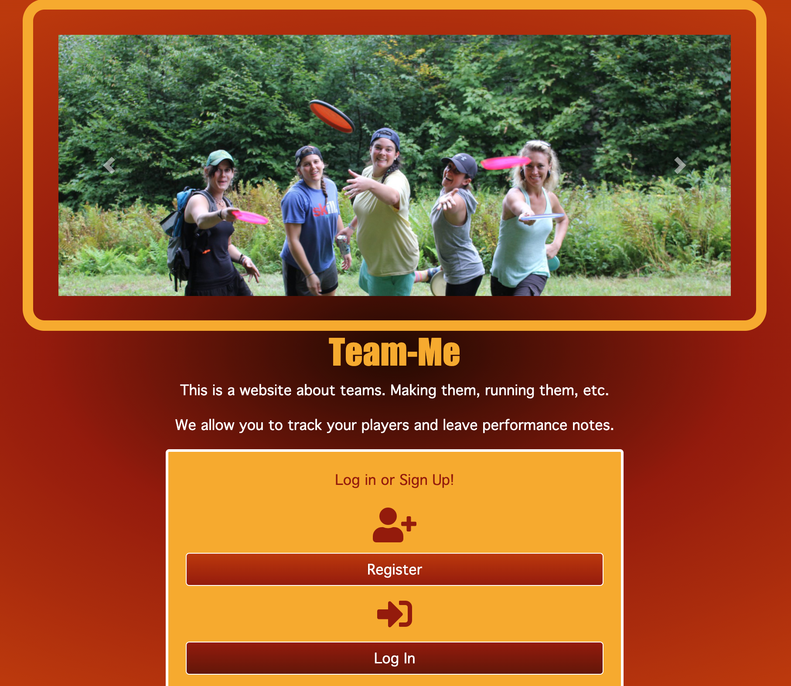
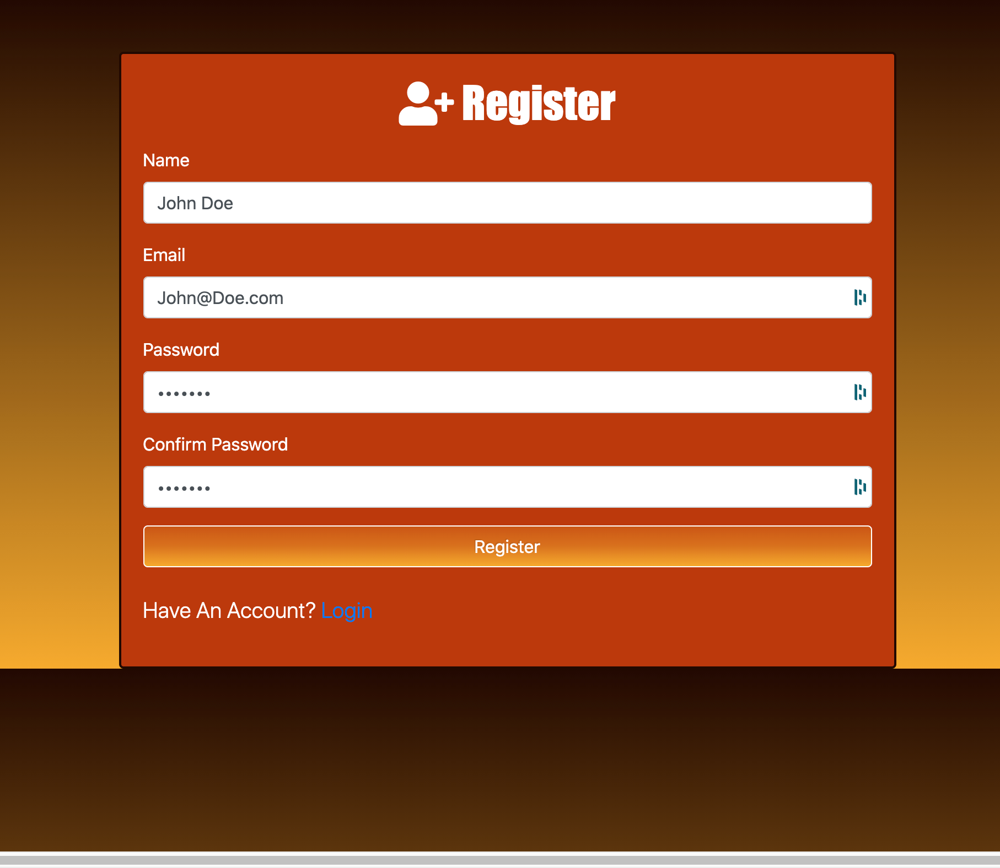
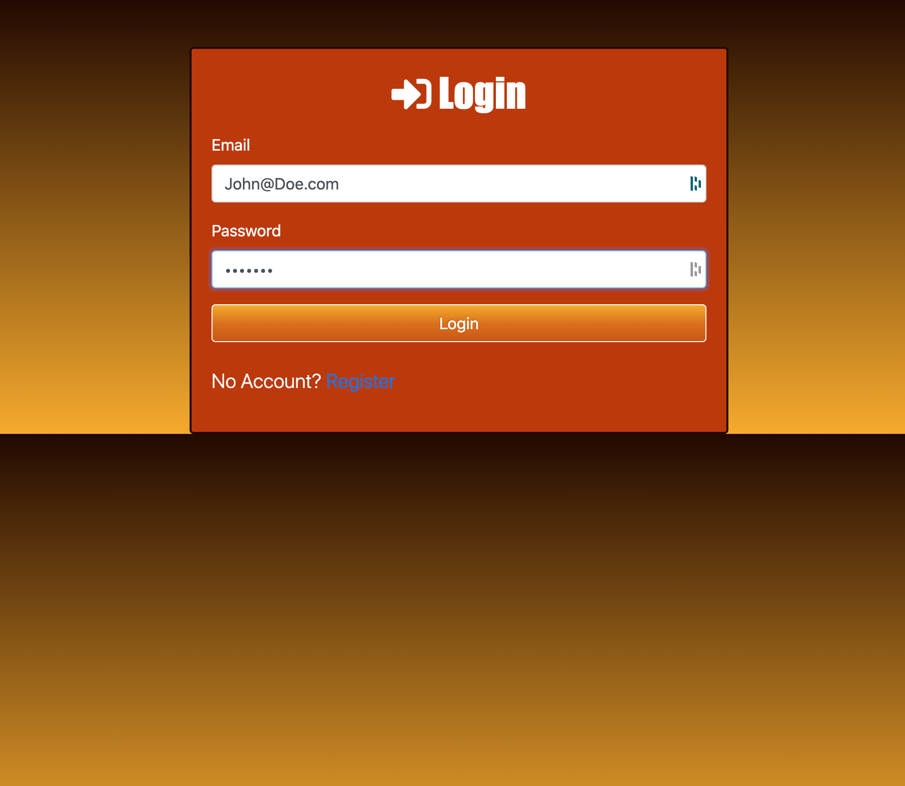
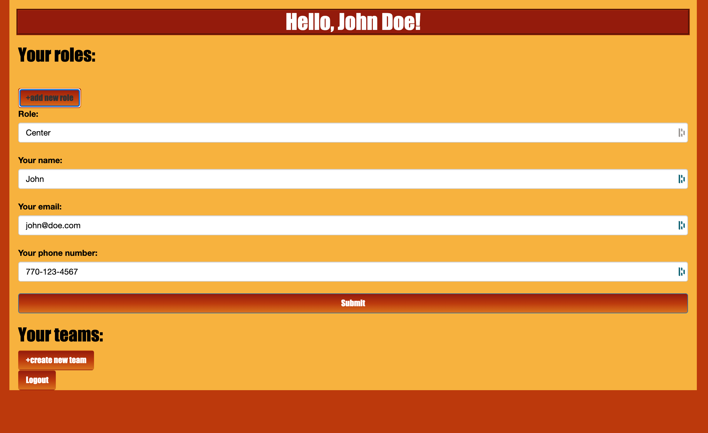
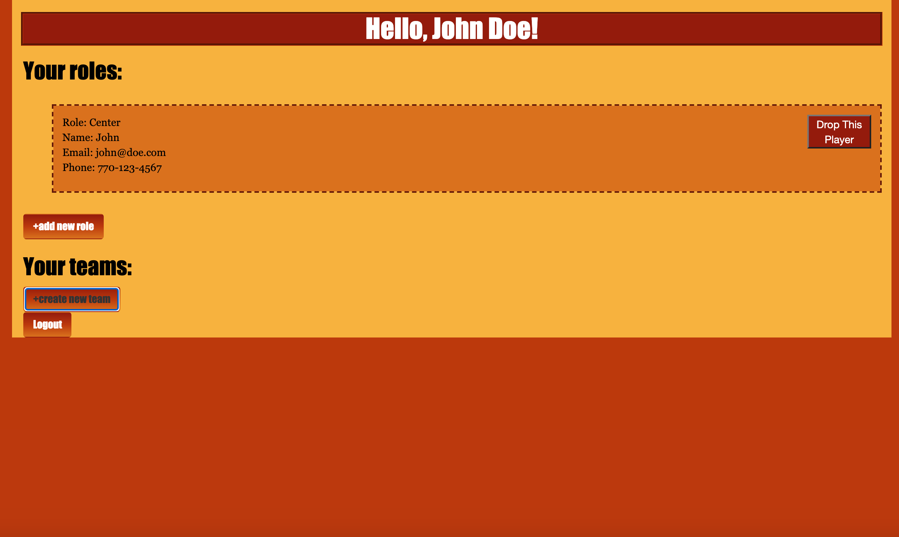

# Team-Me

##### In the words of `Henry Ford` :
> *"Coming together is a beginning. Keeping together is progress. Working together is success"*

 
Team-Me is an application for managing multiple teams and multiple players. With Team-Me you'll be able to manage which players are
on your team, as well as the roles they will be playing. Players will be able to log in and see what roles they are given in advance of
any competition. Verified players will also be able to be a part of many different teams at the same time. 

### Creators
* <a href="https://www.linkedin.com/in/andrew-pham-3b5464b4/">Andrew Pham</a>
* <a href="https://www.linkedin.com/in/thor-hlavaty-7589431b5/">Thor Hlavaty</a>
* <a href="https://www.linkedin.com/in/katherine-frain-92999ba7/">Katherine Frain</a>
* <a href="https://www.linkedin.com/in/jackson-godwin-78547939/">Jackson Godwin</a>

### Languages and Technologies used
* <a href="https://developer.mozilla.org/en-US/docs/Web/JavaScript">Javascript</a>
* <a href="https://www.postgresql.org/">PostgreSQL</a>
* <a href="https://nodejs.org/en/">Node.js</a>
  * #### [Modules used](https://www.npmjs.com/):
    * [Express](https://expressjs.com/) || [Sequelize](https://sequelize.org/) || [Passport](http://www.passportjs.org/) || [Connect-Flash](https://www.npmjs.com/package/connect-flash) || [bcrypt](https://www.npmjs.com/package/bcrypt)
* <a href="https://developer.mozilla.org/en-US/docs/Web/CSS">CSS</a>
* <a href="https://developer.mozilla.org/en-US/docs/Web/HTML">HTML</a>

## **Site Walkthrough**

### **Arrival**

As a user arrives they are greeted with a Homepage that links them to a Register page if they are first time users, and a Login page if they are a returning user.
 
 

### **Register Page**

Here on the Register page a new user will create an account using Name, Email, and a Password. 
 
 

### **Login Page**

A user with an existing account will enter their login credentials to then gain access the Player Role creation page.
 
 

### **Creating Team Role**

A user can now enter their player information into the Team Role page. This page will include the contact information of the player, as well as an option to include what their specific role on that team will be. Players will be able to have multiple rolls for multiple teams.
 
 

### **Dashboard Page**

This page will allow users to see what teams they are attached to, as well as what multiple roles they may have for each of their teams.